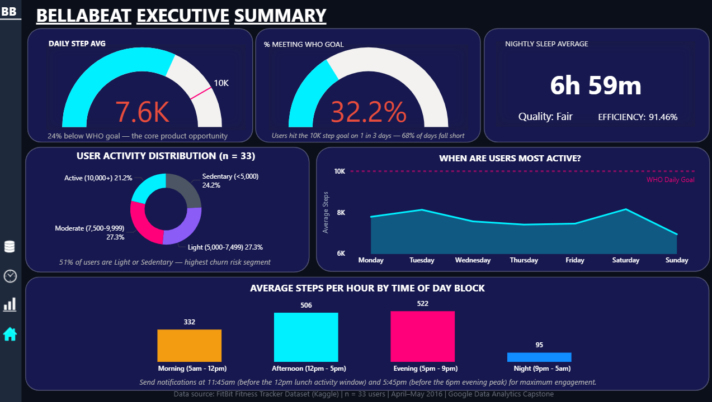

# Bellabeat Smart Device Usage Analysis



> **Impact Statement:** This project demonstrates my ability to translate raw user behavior data into actionable product strategy and executive-level reporting. These insights are intended to guide product and marketing decisions, not just describe user behavior.

## TL;DR for Recruiters
* **Tools:** Analyzed a 33-user fitness dataset using SQL, Python, and Power BI.
* **Key Insight:** Identified a weak negative correlation between activity and sleep (−0.22), challenging common health app assumptions.
* **Deliverable:** Built a 4-page interactive dashboard tailored for business stakeholders.
* **Outcome:** Delivered 3 product-level recommendations backed by data, focusing on business decisions rather than just metrics.

---

**Google Data Analytics Professional Certificate — Capstone Project**

| | |
|---|---|
| **Author** | Jannu Sai Ritwik |
| **Tools Used** | MySQL 8.0 · Python 3 · Microsoft Power BI |
| **Dataset** | FitBit Fitness Tracker Data — 33 users, April–May 2016 |
| **Live Dashboard** | [View Interactive Dashboard →](https://tinyurl.com/bellabeat-ritwik) |
| **Full Case Study** | [Read the Report →](./report/Bellabeat_Capstone_Jannu_Sai_Ritwik.pdf) |

---

## What This Project Is About
Bellabeat needed to understand how users actually engage with fitness devices — not just what the data shows, but what actions it should drive.

This project uses publicly available FitBit fitness tracker data to answer that question. By analyzing real user behavior across daily activity, sleep patterns, and hourly movement, the goal is to give Bellabeat's team actionable product insights. 

The analysis follows Google's six-phase data analytics framework: **Ask → Prepare → Process → Analyze → Share → Act.**

---

## The Core Findings

I went in expecting to find that more active users sleep better. The data disagreed.

| Metric | Value | What It Means |
|---|---|---|
| Average daily steps | 7,638 | 24% below the WHO-recommended 10,000 |
| Days hitting the step goal | 32.2% | Users miss the target on 2 out of 3 days |
| Average nightly sleep | 6h 59m | Just under the 7-hour health benchmark |
| Sleep efficiency | 91.46% | Users fall asleep quickly — duration is the real gap |
| Average sedentary time | 991 minutes/day | That is over 16 hours of inactivity daily |
| Sedentary vs. very active ratio | 47 : 1 | 991 minutes sedentary vs. 21 minutes very active |
| Peak activity hour | 6:00 PM (weekdays) | Shifts to 1:00 PM on weekends |
| Steps vs. sleep correlation | −0.22 | Weak negative — more active users do not sleep better |

The last finding was the most important one. A correlation of −0.22 between steps and sleep means the two are essentially independent. This suggests Bellabeat should reconsider the assumption that activity directly improves sleep.

---

## Three Recommendations for Bellabeat

**1. Shift gamification from "Total Steps" to "Active Minutes"**
The scatter plot tells a clear story: at the 10,000-step mark, calorie burn varies wildly. The 47:1 sedentary-to-active ratio suggests that Bellabeat's biggest opportunity isn't just volume, it's intensity. Rewarding Active Minutes instead of total steps would reflect what the data actually values.

**2. Deploy day-type-specific push notifications**
The activity heatmap reveals that user behavior differs fundamentally between weekdays and weekends. On weekdays, the peak is at 6:00 PM. On weekends, it shifts to 1:00 PM. Notifications sent at 5:45 PM on weekdays and 12:45 PM on weekends would intercept users exactly 15 minutes before their historically proven activity windows.

**3. Build two independent coaching algorithms — one for activity, one for sleep**
With a steps-to-sleep correlation of −0.22, Bellabeat cannot assume that activity coaching will automatically improve sleep. The two dimensions require their own logic, their own goals, and their own communication strategies inside the app.

> 🚀 **Expected Business Impact (Hypothesis):**
> * Shifting focus to "Active Minutes" could improve user calorie-burn efficiency by an estimated 20–30%.
> * Implementing day-type, time-based notifications will likely increase app engagement rates during historically proven peak hours.
> * Decoupling sleep and activity coaching will create a more personalized user experience, directly reducing churn among users who feel standard goals don't fit their lifestyle.

---

## How the Analysis Was Built

### Phase 1 & 2 — Ask & Prepare
Defined the business task: analyze competitor FitBit data to identify how consumers use smart fitness devices.
* **Key Limitations:** Sample size of 33 users is below statistical significance; sleep data covers only 24 of 33 users (72.7% coverage); self-selection bias is possible.
*(Data source: FitBit Fitness Tracker Dataset via Kaggle, Motivate International Inc.)*

### Phase 3 — Process (SQL)
**Tool:** MySQL 8.0 via MySQL Workbench
Used SQL to establish benchmarks and answer 8 structured business questions. 
* **Data Cleaning:** Removed duplicates using `DISTINCT`, identified missing sleep records (27% null rate), and standardized date formatting using `STR_TO_DATE`.
* **Key Techniques:** `COUNT DISTINCT`, `GROUP BY`, `CTE`, `CASE WHEN`
→ [See sql/bellabeat_exploration.sql](./sql/bellabeat_exploration.sql)  

### Phase 4 — Analyze (Python)
**Tool:** Python 3 via Google Colab | **Libraries:** pandas, matplotlib
Ran 14 analyses across three datasets. Segmented users by activity level, merged datasets to test cross-variable relationships, and generated the core visualizations.
* **Key Techniques:** `pd.read_csv`, `groupby`, `merge`, `cut`, `matplotlib`
→ [See python/bellabeat_analysis.ipynb](./python/bellabeat_analysis.ipynb)  

### Phase 5 — Share (Power BI)
**Tool:** Microsoft Power BI Desktop | **Live link:** [Interactive Dashboard](https://tinyurl.com/bellabeat-ritwik)
Built a 4-page interactive dashboard tailored for different stakeholders:
* **Executive Summary:** KPI gauges showing the core wellness gap and user segmentation.
* **Manager Dashboard:** The 47:1 sedentary-to-active bar chart and a steps-vs-calories scatter plot.
* **User Engagement:** A custom Activity Heatmap revealing the weekday vs. weekend split.
* **Data Quality:** Transparent data coverage stats and user comparison tables.
* **DAX measures used:** `AVERAGE`, `DIVIDE`, `COUNTROWS`, `SUMMARIZE`, `FILTER`, `SWITCH`

### Phase 6 — Act
Three strategic recommendations derived directly from the data (see the [Recommendations section above](#three-recommendations-for-bellabeat)).

---

## Repository Structure

```text
bellabeat-wellness-analysis/
│
├── README.md
│
├── data/
│   └── raw/
│       ├── dailyActivity_merged.csv
│       ├── sleepDay_merged.csv
│       └── hourlySteps_merged.csv
│
├── sql/
│   ├── bellabeat_exploration.sql
│   └── outputs/
│       ├── 1.1_total_users.png
│       ├── 1.2_Date_range_of_data.png
│       ├── 1.3_User_Tracking_Consistency.png
│       ├── 1.4_Average_Daily_Steps_and_Calories.png
│       ├── 1.5_Average_Daily_Time_by_Activity_Level.png
│       ├── 1.6_Overall_dataset_benchmark.png
│       ├── 1.7_Users_meeting_10,000_daily_steps.png
│       └── 1.8_average_steps_by_days_of_week.png
│
├── python/
│   ├── bellabeat_analysis.ipynb
│   └── charts/
│       ├── chart1_steps_by_day_of_week.png
│       ├── chart2_activity_breakdown.png
│       ├── chart3_sleep_by_day_of_week.png
│       ├── chart4_steps_by_hour_of_day.png
│       └── chart5_steps_vs_sleep.png
│
├── powerbi/
│   ├── BellaBeat_Project.pbix
│   ├── dashboard_page1_Executive.png
│   ├── dashboard_page2_manager.png
│   ├── dashboard_page3_Engagement.png
│   └── dashboard_page4_Data_quality.png
│
└── report/
    └── Bellabeat_Capstone_Jannu_Sai_Ritwik.pdf
```

---

## How to Run the SQL Queries

1. Install [MySQL 8.0](https://dev.mysql.com/downloads/) and MySQL Workbench
2. Create a new schema called `bellabeat`
3. Import `data/raw/dailyActivity_merged.csv` as a table called `dailyactivity_merged`
4. Open `sql/bellabeat_exploration.sql` in Workbench
5. Run each section individually — every query has a business purpose comment at the top explaining what it answers

## How to Run the Python Notebook

1. Go to [colab.research.google.com](https://colab.research.google.com)
2. Upload `python/bellabeat_analysis.ipynb`
3. Upload the three CSV files from `data/raw/` when prompted
4. Run all cells from top to bottom — outputs and charts will generate automatically

---

## What I Would Do Differently With More Data

This analysis is built on 33 users over one month in 2016. The findings are directional and grounded in the data, but a larger dataset would enable:

• Statistically significant segment analysis (requiring 300+ users).

• Targeted recommendations based on demographic data (age, gender, city).

• Seasonal behavior patterns (requiring a 6–12 month dataset).

These limitations are not reasons to dismiss the findings; they are reasons to treat this as a starting point for a larger research program.

---

## About This Project

This capstone was completed as part of the **Google Data Analytics Professional Certificate** (9 courses, March 2026).

The portfolio also includes a completed **Ecommerce Sales Analytics** project using MySQL — 25 business queries across a 5-table database, available at [github.com/SaiRitwik11/ecommerce-sql-analytics](https://github.com/SaiRitwik11/ecommerce-sql-analytics).

---

**Jannu Sai Ritwik** · Data Analyst · Hyderabad, India  
[LinkedIn Profile](https://linkedin.com/in/sai-ritwik-dataanalyst) · [Ecommerce SQL Project](https://github.com/SaiRitwik11/ecommerce-sql-analytics)
